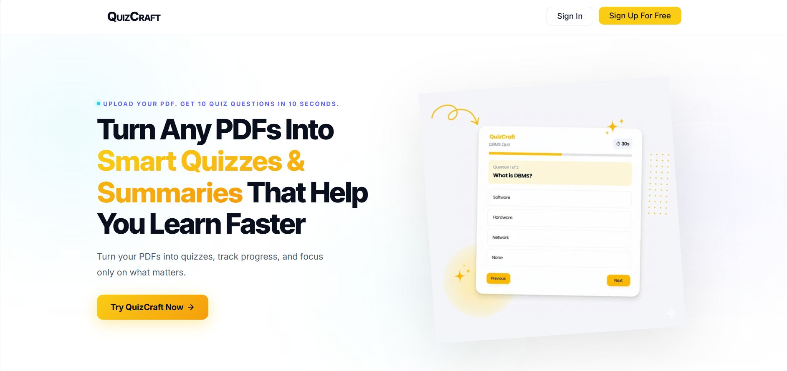
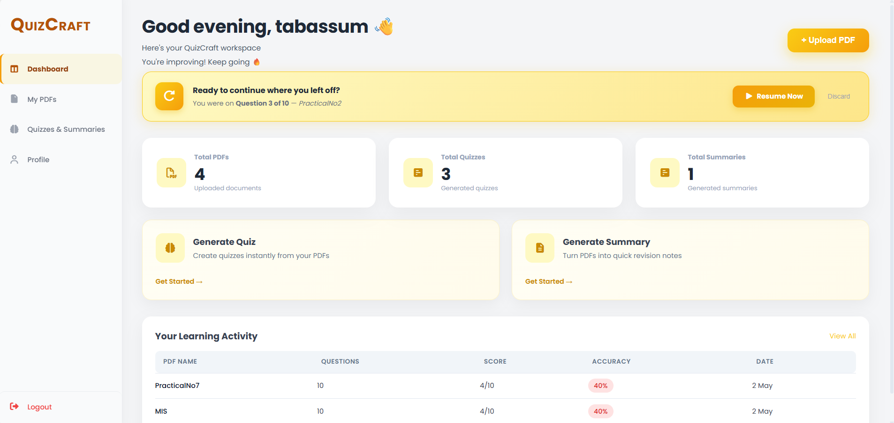
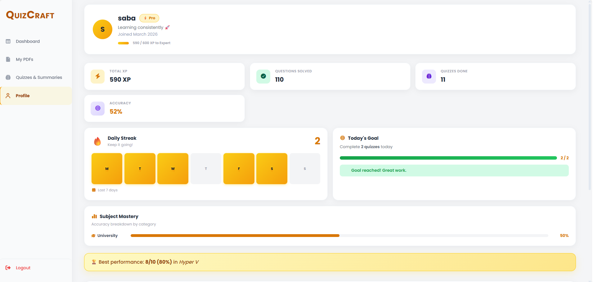
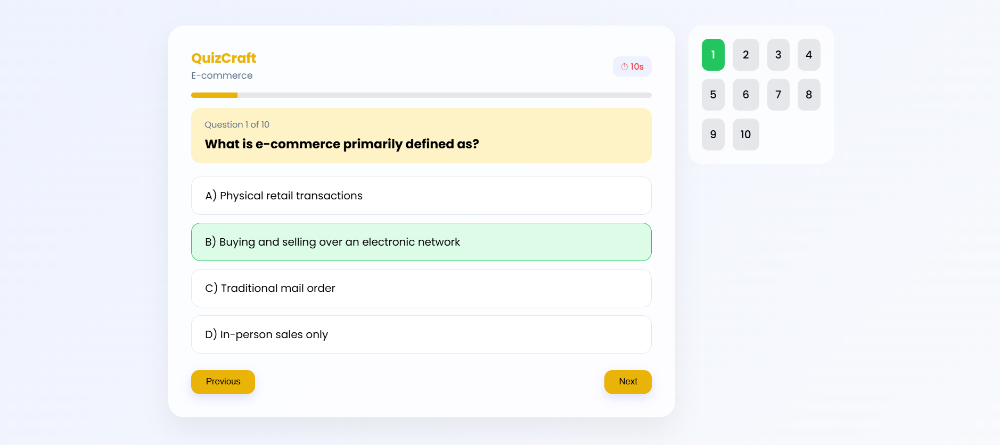
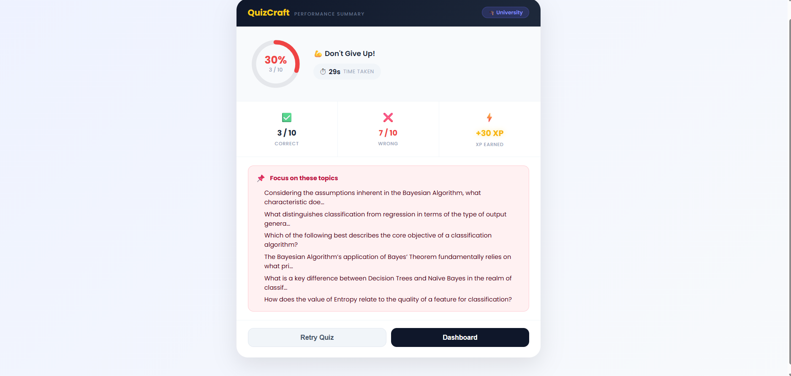
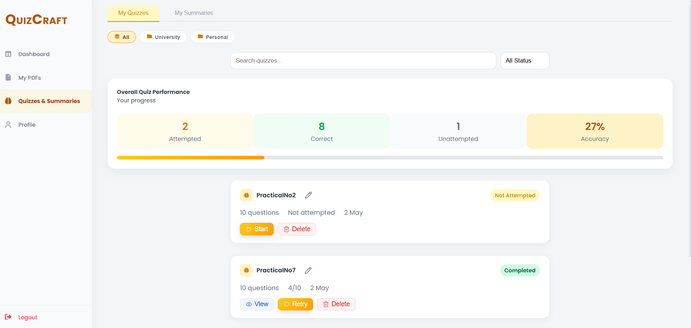
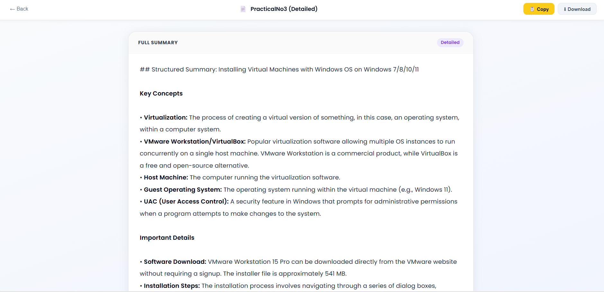

# QuizCraft – AI-Based PDF Quiz & Summary Generator

##  Overview

QuizCraft is an AI-powered web application that transforms static PDF study materials into interactive learning content. Users can upload PDFs to automatically generate Multiple Choice Questions (MCQs) and concise summaries, making revision faster and more effective.

---

##  Features

*  Upload PDF documents
*  AI-based MCQ generation
*  AI-generated summaries
*  Timer-based quiz interface
*  Instant scoring & performance analysis
*  Weak topic identification
*  Dashboard for quiz history
*  Gamification with achievement badges
*  Secure user authentication

---

##  Tech Stack

* **Frontend:** HTML, CSS, JavaScript
* **Backend:** Supabase
* **Database:** PostgreSQL
* **AI Integration:** OpenRouter API
* **PDF Processing:** PDF.js
* **Serverless Functions:** Deno

---

##  How It Works

1. User registers and logs in
2. Uploads a PDF file
3. System extracts text from PDF
4. AI generates MCQs and summary
5. User attempts quiz with timer
6. System evaluates and shows results
7. Dashboard stores history and performance

---

##  Security Note

API keys and sensitive configurations are stored securely using environment variables and are not included in this repository.

---

##  Objectives

* Automate quiz generation from PDFs
* Provide instant summaries for quick revision
* Improve learning through interactive assessment
* Reduce manual effort for students and teachers

---

##  Future Enhancements

* Multi-language support
* Difficulty level selection
* Advanced performance analytics
* Mobile application version

##  Screenshots

### Landing Page

### Dashboard

### Profile

### Quiz Interface

### Quiz Result

### Quiz History

### Summary Output

---
## Author
Sabah
BCA Final Year Project

---
## Contribution
This project is for educational purposes. Feel free to explore and learn from the code.
